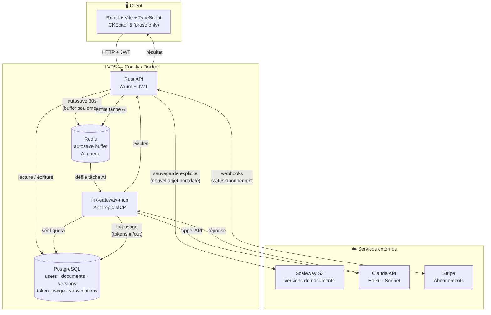

# Ink-Gateway Web App — Schéma d'architecture

```mermaid
graph TB
    subgraph Client["🖥️ Client"]
        FE["React + Vite + TypeScript\nCKEditor 5 (prose only)"]
    end

    subgraph VPS["🐳 VPS — Coolify / Docker"]
        API["Rust API\nAxum + JWT"]
        MCP["ink-gateway-mcp\nAnthropic MCP"]
        PG[("PostgreSQL\nusers · documents · versions\ntoken_usage · subscriptions")]
        REDIS[("Redis\nautosave buffer\nAI queue")]
    end

    subgraph External["☁️ Services externes"]
        S3["Scaleway S3\nversions de documents"]
        CLAUDE["Claude API\nHaiku · Sonnet"]
        STRIPE["Stripe\nAbonnements"]
    end

    FE -->|"HTTP + JWT"| API

    API -->|"lecture / écriture"| PG
    API -->|"autosave 30s\n(buffer seulement)"| REDIS
    API -->|"sauvegarde explicite\n(nouvel objet horodaté)"| S3
    API -->|"enfile tâche AI"| REDIS

    REDIS -->|"défile tâche AI"| MCP
    MCP -->|"vérif quota"| PG
    MCP -->|"log usage\n(tokens in/out)"| PG
    MCP -->|"appel API"| CLAUDE
    CLAUDE -->|"réponse"| MCP
    MCP -->|"résultat"| API
    API -->|"résultat"| FE

    API <-->|"webhooks\nstatus abonnement"| STRIPE
```
